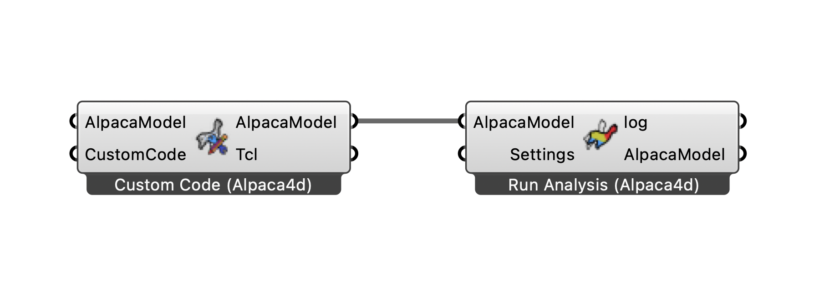

# 💐 Custom Script

The following workflow allows to run any OpenSees tcl script within Grasshopper.

<figure><figcaption></figcaption></figure>

[custom-code](https://raw.githubusercontent.com/Alpaca4d/alpaca4d.github.io/main/doc/examples/custom-script/custom-script.gh)
