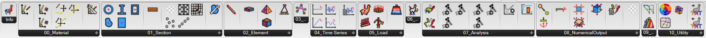

# 🧠 Installation

Grasshopper is a visual programming language for Rhino3D, a popular 3D modeling software. You can install **Alpaca4d**, also known as add-ons, using the `Package Manager` .

**Package Manager**

1. Open Rhino3D and launch the Package Manager from the Tools menu.
2. In the Package Manager, select the "Grasshopper" category from the drop-down menu.
3. Search for **Alpaca4d** and click the "Install" button. The Package Manager will download and install the plugin.
4. Restart Rhino3D to activate the plugin. You should now be able to use the plugin in Grasshopper.

👏 Congratulations! If you have correctly follow the step above, you will find the Alpaca4d toolbar on Grasshopper.

<figure><figcaption>
alpaca4d toolbar
</figcaption></figure>
